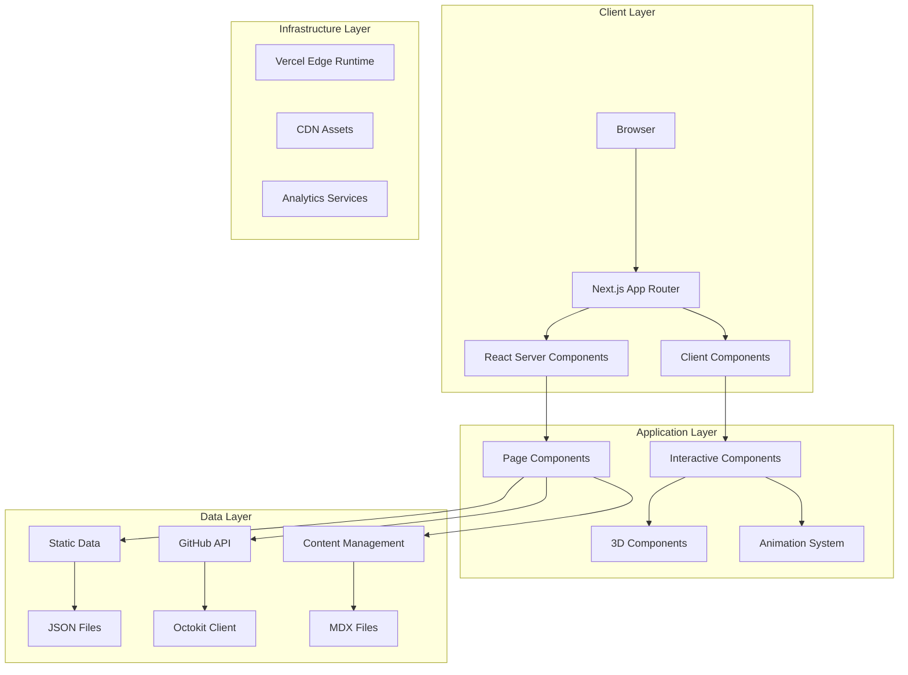

# Elite Developer Portfolio - Design Document

## Overview

The Elite Developer Portfolio is architected as a high-performance Next.js 15 application leveraging the App Router, Server Components, and modern web technologies to create an immersive, interactive showcase platform. The design emphasizes performance, accessibility, and visual excellence while demonstrating advanced frontend development capabilities through its own implementation.

The architecture follows a modular, scalable approach with clear separation of concerns, enabling easy maintenance and future enhancements. Every technical decision serves dual purposes: delivering exceptional user experience and showcasing professional development expertise.

## Architecture

### System Architecture



### Technology Stack

#### Core Framework

- **Next.js 15.4.3**: App Router with Server Components for optimal performance
- **React 19.1.0**: Latest React features with concurrent rendering
- **TypeScript 5**: Full type safety and developer experience
- **Tailwind CSS 4**: Utility-first styling with custom design system

#### Advanced Dependencies

```json
{
  "visual-animation": {
    "@react-three/fiber": "^8.15.0",
    "@react-three/drei": "^9.88.0",
    "three": "^0.158.0",
    "framer-motion": "^10.16.0",
    "lottie-react": "^2.4.0"
  },
  "content-management": {
    "next-mdx-remote": "^4.4.0",
    "react-syntax-highlighter": "^15.5.0",
    "gray-matter": "^4.0.3",
    "reading-time": "^1.5.0"
  },
  "data-visualization": {
    "recharts": "^2.8.0",
    "d3": "^7.8.0",
    "@octokit/rest": "^20.0.0"
  },
  "user-experience": {
    "react-hook-form": "^7.47.0",
    "react-hot-toast": "^2.4.0",
    "react-intersection-observer": "^9.5.0",
    "use-sound": "^4.0.1"
  },
  "performance": {
    "sharp": "^0.32.0",
    "next-bundle-analyzer": "^0.7.0",
    "@vercel/analytics": "^1.1.0"
  }
}
```

### Project Structure

```
elite-portfolio/
├── src/
│   ├── app/                          # Next.js App Router
│   │   ├── (admin)/                  # Admin panel routes
│   │   │   ├── dashboard/
│   │   │   └── content-manager/
│   │   ├── about/                    # About page
│   │   ├── projects/                 # Projects showcase
│   │   │   ├── [slug]/              # Individual project pages
│   │   │   └── case-studies/        # Detailed case studies
│   │   ├── blog/                     # Technical blog
│   │   │   ├── [slug]/              # Individual blog posts
│   │   │   └── categories/          # Blog categories
│   │   ├── contact/                  # Contact page
│   │   ├── api/                      # API routes
│   │   │   ├── github/              # GitHub integration
│   │   │   ├── contact/             # Contact form handler
│   │   │   └── analytics/           # Analytics endpoints
│   │   ├── globals.css              # Global styles
│   │   ├── layout.tsx               # Root layout
│   │   └── page.tsx                 # Homepage
│   ├── components/                   # Reusable components
│   │   ├── 3d/                      # Three.js components
│   │   │   ├── HeroScene.tsx
│   │   │   ├── ProjectCard3D.tsx
│   │   │   └── ParticleSystem.tsx
│   │   ├── animations/              # Framer Motion components
│   │   │   ├── PageTransition.tsx
│   │   │   ├── ScrollAnimations.tsx
│   │   │   └── MicroInteractions.tsx
│   │   ├── interactive/             # Interactive elements
│   │   │   ├── SkillRadar.tsx
│   │   │   ├── ProjectShowcase.tsx
│   │   │   └── ContactForm.tsx
│   │   ├── layouts/                 # Layout components
│   │   │   ├── Header.tsx
│   │   │   ├── Footer.tsx
│   │   │   └── Navigation.tsx
│   │   └── ui/                      # Design system components
│   │       ├── Button.tsx
│   │       ├── Card.tsx
│   │       └── Typography.tsx
│   ├── lib/                         # Utilities and configurations
│   │   ├── animations.ts            # Animation configurations
│   │   ├── github-api.ts            # GitHub integration
│   │   ├── analytics.ts             # Analytics setup
│   │   ├── content-loader.ts        # MDX content loading
│   │   ├── theme.ts                 # Theme management
│   │   └── utils.ts                 # General utilities
│   ├── data/                        # Static data and content
│   │   ├── projects.ts              # Project data
│   │   ├── skills.ts                # Skills and technologies
│   │   ├── testimonials.ts          # Client testimonials
│   │   ├── experience.ts            # Career timeline
│   │   └── personal-info.ts         # Personal information
│   ├── styles/                      # Styling system
│   │   ├── globals.css              # Global CSS
│   │   ├── themes.css               # Theme configurations
│   │   └── animations.css           # Custom animations
│   ├── hooks/                       # Custom React hooks
│   │   ├── useGitHub.ts             # GitHub data fetching
│   │   ├── useTheme.ts              # Theme management
│   │   ├── useAnalytics.ts          # Analytics tracking
│   │   └── useIntersectionObserver.ts
│   └── types/                       # TypeScript type definitions
│       ├── project.ts
│       ├── skill.ts
│       └── github.ts
├── public/                          # Static assets
│   ├── models/                      # 3D models and assets
│   ├── videos/                      # Background videos
│   ├── sounds/                      # Audio feedback files
│   ├── images/                      # Optimized images
│   └── documents/                   # Downloadable resources
├── content/                         # MDX content files
│   ├── blog/                        # Blog posts
│   ├── case-studies/                # Project case studies
│   └── learning-notes/              # Technical notes
└── docs/                           # Project documentation
```

## Components and Interfaces

### Core Component Architecture

#### 1. 3D Interactive Hero Section

```typescript
interface HeroSceneProps {
  theme: "dark" | "light" | "neon" | "minimal";
  mousePosition: { x: number; y: number };
  isLoaded: boolean;
}

interface ParticleSystemConfig {
  count: number;
  speed: number;
  size: { min: number; max: number };
  colors: string[];
  interactive: boolean;
}
```

**Implementation Strategy:**

- Three.js scene with floating geometric shapes representing code concepts
- GPU-accelerated particle system with 1000+ particles
- Mouse-responsive camera controls with smooth interpolation
- Shader materials for dynamic lighting and color transitions
- Mobile-optimized LOD (Level of Detail) system

#### 2. Interactive Project Showcase

```typescript
interface ProjectCardProps {
  project: Project;
  index: number;
  isVisible: boolean;
  onHover: (project: Project) => void;
  onClick: (project: Project) => void;
}

interface Project {
  id: string;
  title: string;
  description: string;
  technologies: Technology[];
  images: ImageAsset[];
  liveUrl?: string;
  githubUrl: string;
  featured: boolean;
  complexity: "beginner" | "intermediate" | "advanced";
  metrics: ProjectMetrics;
  caseStudy?: CaseStudy;
}
```

**Implementation Strategy:**

- 3D card transforms with CSS transforms and WebGL fallbacks
- Intersection Observer for performance-optimized animations
- Lazy loading with skeleton states
- Progressive image enhancement with blur-to-sharp transitions

#### 3. Skills Visualization System

```typescript
interface SkillRadarProps {
  skills: SkillCategory[];
  interactive: boolean;
  theme: ThemeConfig;
  animationDelay: number;
}

interface SkillCategory {
  name: string;
  skills: Skill[];
  color: string;
  proficiency: number;
}

interface Skill {
  name: string;
  level: number;
  yearsExperience: number;
  projects: string[];
  certifications?: Certification[];
}
```

**Implementation Strategy:**

- D3.js powered radar charts with smooth animations
- Interactive hover states with detailed skill breakdowns
- Real-time data updates from learning progress tracking
- Responsive design with touch-optimized interactions

### Animation System Architecture

#### Framer Motion Configuration

```typescript
interface AnimationConfig {
  pageTransitions: {
    initial: MotionProps;
    animate: MotionProps;
    exit: MotionProps;
  };
  scrollAnimations: {
    threshold: number;
    triggerOnce: boolean;
    staggerChildren: number;
  };
  microInteractions: {
    hover: MotionProps;
    tap: MotionProps;
    focus: MotionProps;
  };
}
```

#### Performance Optimization Strategy

```typescript
interface PerformanceConfig {
  lazyLoading: {
    threshold: number;
    rootMargin: string;
    triggerOnce: boolean;
  };
  imageOptimization: {
    formats: ["webp", "avif", "jpg"];
    sizes: string;
    priority: boolean;
  };
  codesplitting: {
    dynamicImports: boolean;
    chunkStrategy: "route" | "component";
  };
}
```

## Data Models

### Project Data Model

```typescript
interface ProjectMetrics {
  githubStars: number;
  forks: number;
  commits: number;
  contributors: number;
  linesOfCode: number;
  testCoverage: number;
  performanceScore: number;
  accessibilityScore: number;
}

interface CaseStudy {
  overview: {
    problem: string;
    solution: string;
    impact: MetricValue[];
    timeline: string;
    role: string;
  };
  technicalDetails: {
    architecture: ArchitectureDiagram;
    codeExamples: CodeSnippet[];
    challenges: Challenge[];
    decisions: TechnicalDecision[];
  };
  results: {
    beforeAfter: Comparison;
    metrics: PerformanceMetric[];
    userFeedback: Testimonial[];
    lessonsLearned: string[];
  };
}
```

### GitHub Integration Model

```typescript
interface GitHubData {
  profile: {
    username: string;
    name: string;
    bio: string;
    location: string;
    company: string;
    followers: number;
    following: number;
    publicRepos: number;
  };
  repositories: Repository[];
  contributions: ContributionData;
  languages: LanguageStats;
}

interface ContributionData {
  totalContributions: number;
  weeks: ContributionWeek[];
  longestStreak: number;
  currentStreak: number;
}
```

### Content Management Model

```typescript
interface BlogPost {
  slug: string;
  title: string;
  description: string;
  content: string;
  publishedAt: Date;
  updatedAt: Date;
  tags: string[];
  readingTime: number;
  featured: boolean;
  seo: SEOMetadata;
}

interface SEOMetadata {
  title: string;
  description: string;
  keywords: string[];
  ogImage: string;
  canonicalUrl: string;
}
```

## Error Handling

### Error Boundary Strategy

```typescript
interface ErrorBoundaryState {
  hasError: boolean;
  error?: Error;
  errorInfo?: ErrorInfo;
}

class PortfolioErrorBoundary extends Component<Props, ErrorBoundaryState> {
  // Graceful error handling with fallback UI
  // Error reporting to analytics service
  // Recovery mechanisms for non-critical failures
}
```

### API Error Handling

```typescript
interface APIErrorHandler {
  github: {
    rateLimitExceeded: () => void;
    networkError: () => void;
    invalidToken: () => void;
  };
  contact: {
    validationError: (errors: ValidationError[]) => void;
    serverError: () => void;
    spamDetection: () => void;
  };
  analytics: {
    trackingBlocked: () => void;
    dataProcessingError: () => void;
  };
}
```

### Fallback Strategies

1. **3D Scene Fallbacks**: CSS animations when WebGL is unavailable
2. **Image Fallbacks**: Progressive enhancement from low-quality to high-quality
3. **API Fallbacks**: Cached data when external services are unavailable
4. **Animation Fallbacks**: Reduced motion for accessibility preferences

## Testing Strategy

### Testing Pyramid

#### Unit Tests (70%)

```typescript
// Component testing with React Testing Library
describe("ProjectCard", () => {
  it("should render project information correctly", () => {
    // Test component rendering and props
  });

  it("should handle hover interactions", () => {
    // Test interactive behaviors
  });
});

// Utility function testing
describe("GitHub API utilities", () => {
  it("should format contribution data correctly", () => {
    // Test data transformation logic
  });
});
```

#### Integration Tests (20%)

```typescript
// API integration testing with MSW
describe("GitHub Integration", () => {
  it("should fetch and display repository data", async () => {
    // Test API integration and data flow
  });
});

// Component integration testing
describe("Project Showcase Integration", () => {
  it("should load and display projects with animations", () => {
    // Test component interactions and data flow
  });
});
```

#### End-to-End Tests (10%)

```typescript
// Playwright E2E testing
test("Portfolio navigation and interaction flow", async ({ page }) => {
  await page.goto("/");

  // Test complete user journey
  await page.click('[data-testid="projects-link"]');
  await page.waitForSelector('[data-testid="project-card"]');

  // Test 3D interactions and animations
  await page.hover('[data-testid="hero-scene"]');

  // Test contact form submission
  await page.fill('[data-testid="contact-email"]', "test@example.com");
  await page.click('[data-testid="submit-button"]');
});
```

### Performance Testing

```typescript
interface PerformanceMetrics {
  coreWebVitals: {
    LCP: number; // < 2.5s
    FID: number; // < 100ms
    CLS: number; // < 0.1
  };
  customMetrics: {
    heroSceneLoadTime: number;
    projectCardsRenderTime: number;
    animationFrameRate: number;
  };
}
```

### Accessibility Testing

```typescript
// Automated accessibility testing with jest-axe
describe("Accessibility", () => {
  it("should have no accessibility violations", async () => {
    const { container } = render(<HomePage />);
    const results = await axe(container);
    expect(results).toHaveNoViolations();
  });
});
```

## Performance Optimization

### Core Web Vitals Strategy

#### Largest Contentful Paint (LCP) < 2.5s

- Critical CSS inlining for above-the-fold content
- Hero image preloading with priority hints
- Server-side rendering for initial content
- Edge caching with Vercel Edge Runtime

#### First Input Delay (FID) < 100ms

- Code splitting to reduce main thread blocking
- Web Workers for heavy computations
- Debounced event handlers for interactions
- Optimized JavaScript execution timing

#### Cumulative Layout Shift (CLS) < 0.1

- Explicit dimensions for all images and videos
- Font loading optimization with font-display: swap
- Skeleton screens for dynamic content
- Reserved space for ads and embeds

### Bundle Optimization

```typescript
// Next.js configuration for optimal bundling
const nextConfig: NextConfig = {
  experimental: {
    optimizeCss: true,
    optimizePackageImports: ["framer-motion", "@react-three/fiber"],
  },
  images: {
    formats: ["image/avif", "image/webp"],
    deviceSizes: [640, 750, 828, 1080, 1200, 1920, 2048, 3840],
    imageSizes: [16, 32, 48, 64, 96, 128, 256, 384],
  },
  compiler: {
    removeConsole: process.env.NODE_ENV === "production",
  },
};
```

### Caching Strategy

```typescript
interface CachingStrategy {
  static: {
    images: "1 year";
    fonts: "1 year";
    css: "1 year";
    js: "1 year";
  };
  dynamic: {
    api: "5 minutes";
    github: "1 hour";
    blog: "1 day";
  };
  cdn: {
    vercel: "automatic edge caching";
    images: "optimized delivery";
  };
}
```

## Security Considerations

### Content Security Policy

```typescript
const csp = {
  "default-src": ["'self'"],
  "script-src": ["'self'", "'unsafe-inline'", "vercel.live"],
  "style-src": ["'self'", "'unsafe-inline'"],
  "img-src": ["'self'", "data:", "https:"],
  "font-src": ["'self'", "https://fonts.gstatic.com"],
  "connect-src": ["'self'", "https://api.github.com"],
};
```

### Data Protection

```typescript
interface SecurityMeasures {
  contactForm: {
    validation: "server-side validation with Zod";
    sanitization: "DOMPurify for user inputs";
    rateLimiting: "Vercel Edge Functions rate limiting";
    spamProtection: "Honeypot fields and reCAPTCHA";
  };
  analytics: {
    privacy: "GDPR compliant analytics";
    anonymization: "IP address anonymization";
    consent: "Cookie consent management";
  };
}
```

This design document provides a comprehensive blueprint for building the Elite Developer Portfolio. The architecture emphasizes performance, scalability, and user experience while showcasing advanced development capabilities through its implementation. Each component is designed to be modular, testable, and maintainable, ensuring the portfolio can evolve with changing requirements and technologies.
